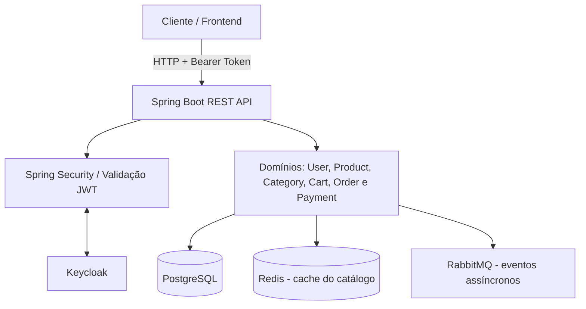
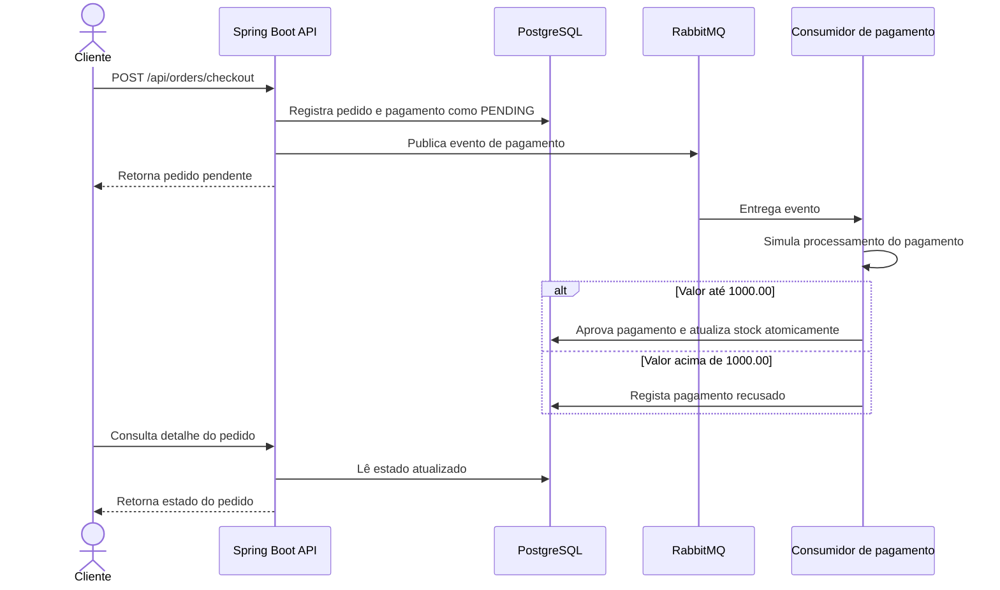
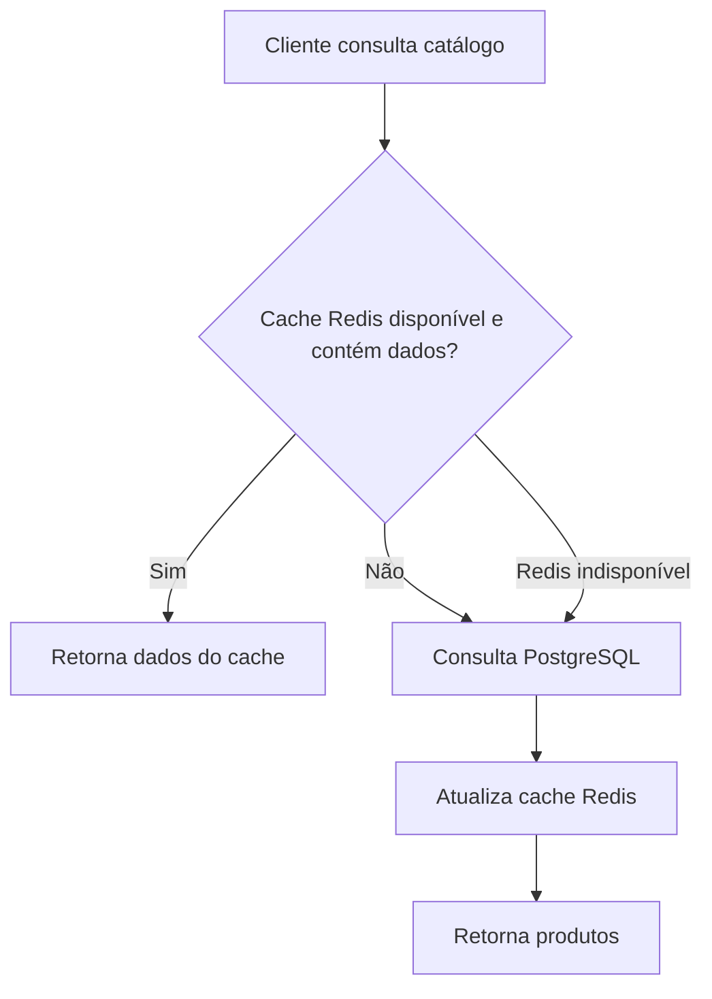

# Supermercado API

API REST para um e-commerce de supermercado, desenvolvida como parte de um desafio técnico utilizando Java 21 e Spring Boot 3.5.16. A aplicação oferece registo e perfil de utilizador, catálogo de produtos e categorias, carrinho de compras, checkout, processamento de pagamento simulado assíncrono e consulta de pedidos.

> **Nota:** confirme no repositório os nomes exatos dos serviços Docker, portas, variáveis de ambiente, rotas, payloads e comandos antes de executar. As imagens/diagramas devem ser referenciados por caminhos relativos do próprio repositório para que sejam renderizados no GitHub.

## Índice

- [Funcionalidades](#funcionalidades)
- [Tecnologias](#tecnologias)
- [Arquitetura](#arquitetura)
- [Decisões Técnicas](#decises-tcnicas)
- [Pré-requisitos](#pr-requisitos)
- [Execução Passo a Passo](#execuo-passo-a-passo)
- [Autenticação e Configuração](#autenticao-e-configurao)
- [Fluxos de Negócio](#fluxos-de-negcio)
- [Exemplos de Uso da API](#exemplos-de-uso-da-api)
- [Testes](#testes)
- [Observabilidade e Tratamento de Erros](#observabilidade-e-tratamento-de-erros)
- [Limitações Conhecidas](#limitaes-conhecidas)

## Funcionalidades

- Registo de utilizador com criação/associação de identidade no Keycloak.
- Consulta pública de produtos e categorias, com busca, filtros e paginação.
- Gestão de catálogo (categorias e produtos) para utilizadores com perfil administrativo.
- Carrinho de compras por utilizador autenticado, permitindo inclusão, alteração de quantidade e remoção de itens com validação de stock.
- Checkout que cria um pedido e inicia o processamento de pagamento de forma simulada.
- Processamento assíncrono de pagamento e atualização de stock após aprovação.
- Histórico e detalhe de pedidos limitados ao utilizador proprietário.
- Migrações de base de dados versionadas com Flyway.
- Cache em Redis para otimização de leituras do catálogo.
- Documentação OpenAPI/Swagger, *health checks* e métricas.

## Tecnologias

| **Tecnologia**                       | **Responsabilidade**                                           |
| ------------------------------------ | -------------------------------------------------------------- |
| **Java 21**                          | Linguagem principal da aplicação                               |
| **Spring Boot 3.5.16**               | Framework base e configuração da API                           |
| **Spring Data JPA / Hibernate**      | Persistência relacional e ORM                                  |
| **PostgreSQL 16**                    | Base de dados relacional transacional                          |
| **Redis**                            | Cache de leitura para o catálogo                               |
| **RabbitMQ**                         | Mensageria para processamento assíncrono de pagamentos         |
| **Flyway**                           | Versionamento e aplicação de migrações na base de dados        |
| **Keycloak**                         | Provedor de identidade, login e emissão de tokens JWT          |
| **Spring Security / OAuth2**         | Validação de tokens e proteção dos endpoints (Resource Server) |
| **Docker & Compose**                 | Contentorização e orquestração local dos serviços              |
| **OpenAPI / Swagger UI**             | Exploração e teste manual dos endpoints                        |
| **JUnit / Mockito / Testcontainers** | Testes automatizados de unidade e integração                   |

## Arquitetura

A aplicação segue uma arquitetura de monólito modular, organizada por domínios de negócio. Essa abordagem mantém a implantação simples para o escopo do desafio, sem misturar as responsabilidades de cada domínio.

Plaintext

```
Cliente / Frontend
       |
       | HTTP + Bearer Token
       v
Spring Boot REST API
  |-- Spring Security (Validação JWT e Autorização)
  |-- user: registo e perfil
  |-- product / category: catálogo
  |-- cart: carrinho
  |-- order: checkout e pedidos
  |-- payment: processamento assíncrono
       |
       +------ PostgreSQL 16 (Dados transacionais)
       +------ Redis         (Cache do catálogo)
       +------ RabbitMQ      (Eventos de pagamento e stock)
       +------ Keycloak      (Identidade e tokens)

```

### Organização dos Pacotes

| **Pacote**    | **Responsabilidade**                                                  |
| ------------- | --------------------------------------------------------------------- |
| `config/`     | Configurações de segurança, cache, RabbitMQ, Keycloak, JPA e OpenAPI. |
| `common/`     | Entidade base, métricas e logging de requisições.                     |
| `exceptions/` | Exceções de negócio e tratamento global de erros.                     |
| `user/`       | Registo e perfil de utilizador.                                       |
| `category/`   | Consulta e administração de categorias.                               |
| `product/`    | Catálogo, filtros e acesso ao cache.                                  |
| `cart/`       | Gestão de carrinhos e itens.                                          |
| `order/`      | Checkout, criação de pedidos e finalização.                           |
| `payment/`    | Pagamento simulado, publicação/consumo de eventos e reconciliação.    |

*(Consulte a pasta `docs/` no repositório para diagramas detalhados de modelagem de dados e arquitetura, caso existam).*

## Decisões Técnicas

### PostgreSQL 16

Escolhido por oferecer persistência relacional robusta. O domínio possui relações claras (utilizadores, produtos, pedidos, etc.). Transações, chaves estrangeiras e *locks* pessimistas ajudam a preservar invariantes de negócio durante o checkout e a baixa de stock. Valores monetários são persistidos com precisão decimal.

### Keycloak + JWT

Atua centralizando a identidade e a emissão dos tokens. A API funciona como um *OAuth2 Resource Server*, validando a assinatura e a expiração do JWT, além de converter as *roles* do *realm* em autoridades do Spring Security. Senhas não são armazenadas pela aplicação de negócio.

### RabbitMQ (Mensageria e Pagamento Simulado)

O RabbitMQ desacopla o checkout do processamento do pagamento. O checkout regista o pedido e o pagamento como pendentes, e o processamento ocorre via consumidores assíncronos.

*Nota sobre a simulação:* O gateway é fictício. A regra configurada recusa valores acima de `1000.00`; valores abaixo ou iguais são aprovados. Um *job* de reconciliação republica eventos associados a pagamentos que ficaram pendentes por tempo excessivo. Há também uma *dead-letter queue* para falhas repetidas.

### Redis

Reduz consultas repetidas ao PostgreSQL para listagem e detalhes do catálogo. O TTL padrão é de 60 segundos. A estratégia é *fail-open*: em caso de falha no Redis, a API tenta consultar diretamente a base de dados.

### Flyway, DTOs e Validação

Mudanças de *schema* são versionadas (`V1__init.sql`, `V2__seed.sql`). DTOs e *Bean Validation* separam o contrato HTTP das entidades persistidas, garantindo a integridade dos dados de entrada.

## Pré-requisitos

- Git.
- Docker e Docker Compose.
- JDK 21 e Maven Wrapper (`./mvnw`), caso deseje compilar ou executar fora do Docker.
- Portas locais disponíveis (`8080` para a API, `7080` para o Keycloak, `5432` para o Postgres, etc., conforme `docker-compose.yaml`).

## Execução Passo a Passo

1. **Obter o projeto:**

   Bash
   ```
   git clone https://github.com/eusamir/supermercado-voce-no-coracao-da-gente.git
   cd supermercado-voce-no-coracao-da-gente

   ```
2. **Validar a configuração do Compose:**

   Bash
   ```
   docker compose config

   ```
3. **Subir a infraestrutura e a API:**

   Bash
   ```
   docker compose up -d --build

   ```
4. **Acompanhar os logs:**

   A primeira inicialização pode demorar enquanto as imagens são descarregadas e as *migrations* aplicadas.

   Bash
   ```
   docker compose logs -f
   # Ou para um serviço específico:
   docker compose logs -f api

   ```
5. **Verificar o estado dos serviços:**

   Bash
   ```
   docker compose ps

   ```
6. **Encerrar os serviços:**

   Bash
   ```
   docker compose down
   # Utilize a flag -v apenas se desejar apagar os volumes de dados persistidos:
   # docker compose down -v

   ```

## Autenticação e Configuração

Para aceder a *endpoints* protegidos, é necessário enviar um token JWT válido no cabeçalho:

HTTP

```
Authorization: Bearer <access_token>

```

### Obter token de teste via Keycloak (Local)

Os comandos abaixo extraem um token utilizando o *realm* `supermercado` e os utilizadores de demonstração configurados (`admin` e `cliente`). *Nota: Requer o Python3 instalado para o parse do JSON ou ferramentas como o `jq`.*

**Token de Administrador:**

Bash

```
export KC_TOKEN_URL="http://localhost:7080/realms/supermercado/protocol/openid-connect/token"

export ADMIN_TOKEN=$(curl -sS -X POST "$KC_TOKEN_URL" \
  -H "Content-Type: application/x-www-form-urlencoded" \
  -d "grant_type=password" \
  -d "client_id=supermercado-frontend" \
  -d "username=admin" \
  -d "password=123456" | python3 -c 'import sys,json; print(json.load(sys.stdin)["access_token"])')

```

**Token de Cliente:**

Bash

```
export CUSTOMER_TOKEN=$(curl -sS -X POST "$KC_TOKEN_URL" \
  -H "Content-Type: application/x-www-form-urlencoded" \
  -d "grant_type=password" \
  -d "client_id=supermercado-frontend" \
  -d "username=cliente" \
  -d "password=123456" | python3 -c 'import sys,json; print(json.load(sys.stdin)["access_token"])')

```

### Controlo de Acesso

| **Recurso / Rota**                                      | **Nível de Acesso**                   |
| ------------------------------------------------------- | ------------------------------------- |
| `POST /api/users`                                       | Público                               |
| `GET /api/products` e `GET /api/products/{id}`          | Público                               |
| `GET /api/categories`                                   | Utilizador autenticado                |
| Carrinho, Perfil e Pedidos (`/api/cart`, `/api/orders`) | Utilizador autenticado (proprietário) |
| `/api/admin/**` e gestão de catálogo                    | Role `ADMIN`                          |
| Swagger, OpenAPI e `/actuator/health`                   | Público                               |

## Fluxos de Negócio

1. **Catálogo e Busca:** O frontend consulta a listagem pública de produtos, aplicando filtros e paginação. As respostas são fornecidas rapidamente via Redis.
2. **Carrinho de Compras:** O utilizador autenticado consulta o seu carrinho. A API calcula os totais baseada nas regras de backend e valida o stock sempre que uma quantidade é alterada.
3. **Checkout:** Ao submeter o carrinho, o pedido é criado como `PENDING`. O pagamento simulado é encaminhado para o RabbitMQ.
4. **Pagamento e Stock:** O processamento assíncrono dita o resultado. Se o pagamento for inferior a `1000.00`, é aprovado e as baixas de stock são aplicadas de forma atómica.
5. **Consulta de Pedido:** Como a aprovação não é síncrona, o frontend deve consultar o detalhe do pedido para apresentar o estado final ao utilizador.

## Diagramas e Fluxos de Negócio

Os fluxos abaixo resumem o comportamento descrito para a API. Se o repositório já contiver imagens desses diagramas, substitua ou complemente os blocos Mermaid com os caminhos relativos reais dos arquivos. No Markdown, a referência deve seguir o formato ``.

### Arquitetura da aplicação



### Fluxo de checkout e pagamento



### Fluxo de consulta do catálogo



### Referenciar imagens já existentes no repositório

Para usar os arquivos de imagem existentes, localize-os no projeto e adicione as referências relativas correspondentes. Exemplos de sintaxe (os nomes abaixo são ilustrativos e não afirmam que esses arquivos existam):

```markdown


```

## Exemplos de Uso da API

Defina a variável com a base da API:

Bash

```
export API="http://localhost:8080"

```

**Consultar Catálogo (Público):**

Bash

```
curl -i "$API/api/products?search=banana&page=0&size=5"

```

**Consultar o Perfil Autenticado:**

Bash

```
curl -i "$API/api/users/me" \
  -H "Authorization: Bearer $CUSTOMER_TOKEN"

```

**Adicionar item ao Carrinho:**

Bash

```
curl -i -X POST "$API/api/cart/items" \
  -H "Authorization: Bearer $CUSTOMER_TOKEN" \
  -H "Content-Type: application/json" \
  -d '{
    "productId": "<UUID-DO-PRODUTO>",
    "quantity": 2
  }'

```

**Realizar Checkout:**

Bash

```
curl -i -X POST "$API/api/orders/checkout" \
  -H "Authorization: Bearer $CUSTOMER_TOKEN"

```

**Operação Administrativa (Ex: Listar produtos na visão admin):**

Bash

```
curl -i "$API/api/admin/products" \
  -H "Authorization: Bearer $ADMIN_TOKEN"

```

*Para visualizar a documentação completa dos contratos e schemas, aceda ao Swagger UI localmente em `http://localhost:8080/swagger-ui/index.html`.*

## Testes

Para executar a suite de testes unitários e de integração (que utilizam Testcontainers para levantar dependências temporárias como Postgres e RabbitMQ), execute:

Bash

```
./mvnw test

```

Para compilar, validar testes e gerar o pacote final:

Bash

```
./mvnw clean package

```

## Observabilidade e Tratamento de Erros

- **Códigos HTTP Padronizados:**
    - `200 OK` e `201 Created` para sucessos.
    - `400 Bad Request` para erros de validação de *payload*.
    - `401 Unauthorized` / `403 Forbidden` tratados via Spring Security.
    - `404 Not Found` para recursos inexistentes ou acessos não autorizados a recursos de terceiros.
    - `409 Conflict` em caso de falta de stock ou estado inválido.
- **Problem Details:** Erros de negócio são convertidos no padrão RFC 9457 (`ProblemDetail`).
- **Métricas:** O `RequestLoggingFilter` gera e propaga um `X-Request-Id`. O *Spring Boot Actuator* disponibiliza *health checks* e o *Micrometer/Prometheus* expõe métricas de performance da aplicação.

## Limitações Conhecidas

- O fluxo de pagamento é inteiramente simulado; não existe integração real com adquirentes financeiras.
- Funcionalidades como seleção de endereço de entrega, cálculo de portes (frete) e escolha de método de pagamento foram deixadas fora do escopo do desafio.
- A política de CORS atual está orientada para permitir tráfego de `http://localhost:4200` (Angular/Frontend padrão).
- As credenciais de demonstração inseridas no ficheiro de configuração do Keycloak não têm segurança adequada e **nunca** devem ser transportadas para ambientes produtivos.