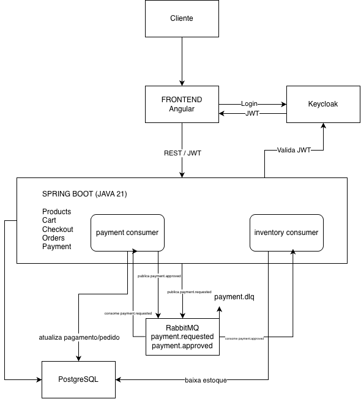

# Supermercado API

API REST para um e-commerce de supermercado, desenvolvida como parte de um desafio técnico. A aplicação contempla catálogo de produtos, cadastro de usuários, carrinho de compras, checkout, processamento simulado de pagamento e consulta de pedidos.

> **Nota de validação:** este documento foi elaborado com base no escopo do desafio e nas decisões de arquitetura discutidas durante o desenvolvimento. Antes da entrega, confira os nomes exatos dos serviços Docker, portas, variáveis de ambiente, rotas, payloads e comandos diretamente no repositório. Não considere comandos ou cenários como testados até executá-los localmente.

## Índice

- [Funcionalidades](#funcionalidades)
- [Tecnologias](#tecnologias)
- [Arquitetura](#arquitetura)
- [Decisões técnicas](#decisões-técnicas)
- [Pré-requisitos](#pré-requisitos)
- [Execução local com Docker](#execução-local-com-docker)
- [Configuração e autenticação](#configuração-e-autenticação)
- [Fluxos de negócio](#fluxos-de-negócio)
- [API e documentação](#api-e-documentação)
- [Testes](#testes)
- [Tratamento de erros](#tratamento-de-erros)
- [Limitações](#limitações)

## Funcionalidades

- Cadastro de usuário associado à identidade autenticada.
- Consulta de produtos e categorias.
- Busca e filtros no catálogo, conforme os parâmetros disponibilizados pela API.
- Carrinho associado ao usuário autenticado.
- Inclusão, alteração de quantidade e remoção de itens.
- Validação de disponibilidade e estoque.
- Checkout que gera um pedido e inicia o processamento simulado do pagamento.
- Consulta de pedidos e de seus estados.
- Controle de acesso por autenticação e autorização.
- Migrações versionadas do banco de dados.
- Documentação OpenAPI/Swagger e testes automatizados, conforme configurados no projeto.

## Tecnologias

| Tecnologia | Responsabilidade |
|---|---|
| Java 21 | Linguagem da aplicação |
| Spring Boot 3 | Framework e configuração da API |
| Spring Web | Exposição de endpoints REST |
| Spring Data JPA / Hibernate | Persistência relacional, se configurados no projeto |
| PostgreSQL | Banco de dados relacional |
| Flyway | Versionamento e aplicação de migrações |
| Keycloak | Provedor de identidade e emissão de tokens |
| Spring Security / OAuth2 Resource Server | Validação do token e proteção dos endpoints |
| RabbitMQ | Mensageria para processamento assíncrono, se habilitado na configuração |
| Docker Compose | Inicialização coordenada dos serviços |
| OpenAPI / Swagger UI | Exploração e teste manual dos endpoints |
| JUnit / Mockito | Testes automatizados, conforme dependências presentes |

Confirme as versões e dependências efetivamente declaradas no `pom.xml`.

## Arquitetura

A solução é organizada como uma API Spring Boot, com responsabilidades separadas entre a camada HTTP, regras de negócio e persistência. A estrutura exata dos pacotes deve ser consultada no código.

```text
Cliente / Frontend
       |
       | HTTP + Bearer Token
       v
Spring Boot REST API <------> Keycloak
       |
       v
Serviços de aplicação / regras de negócio
       |
       +--------------------> PostgreSQL
       |                        ^
       |                        |
       +--> RabbitMQ --> Processador de pagamento simulado
                                |
                                +--> Atualização do pedido/pagamento
                                +--> Atualização do estoque conforme resultado
```

O diagrama representa o fluxo conceitual esperado. Ajuste-o caso a implementação atual utilize outro mecanismo de processamento ou tenha responsabilidades diferentes.

### Diagramas

#### Arquitetura e fluxo da aplicação



#### Modelo de dados


## Decisões técnicas

### PostgreSQL

O PostgreSQL foi escolhido por oferecer persistência relacional, transações, integridade referencial e restrições adequadas para entidades relacionadas, como usuários, produtos, carrinhos, pedidos e pagamentos. Essas propriedades ajudam a manter consistência em operações de negócio que alteram múltiplos registros.

### Keycloak

O Keycloak centraliza a identidade dos usuários e a emissão dos tokens. A API atua como resource server, validando os tokens recebidos e aplicando as regras de autorização. Senhas não devem ser armazenadas pela aplicação de negócio.

No ambiente discutido durante o desenvolvimento, foram considerados o realm `supermercado`, o client `supermercado-api` e as roles `ADMIN` e `CUSTOMER`. Confirme os nomes e a configuração exportada antes da entrega.

### Flyway

As migrações versionadas permitem reconstruir a estrutura do banco de forma rastreável e reproduzível. Alterações no schema devem ser feitas por novas migrações, evitando depender de mudanças manuais no banco.

### RabbitMQ e pagamento simulado

A mensageria desacopla a criação do pedido do processamento do pagamento. O checkout pode registrar o pedido inicialmente como pendente e publicar uma mensagem para processamento posterior. O resultado pode atualizar o estado do pagamento e do pedido.

O estado final não deve ser presumido pelo frontend imediatamente após o checkout: ele precisa ser consultado na API conforme o mecanismo implementado. Confirme no código as transições de estado, a política de aprovação/recusa e o comportamento em caso de falha ou falta de estoque.

## Pré-requisitos

- Git.
- Docker e Docker Compose.
- JDK 21, caso execute a aplicação fora de um container.
- Maven ou Maven Wrapper (`./mvnw`), conforme presente no repositório.
- Acesso ao repositório e às configurações de ambiente necessárias.

## Execução local com Docker

Na raiz que contém o arquivo `docker-compose.yml`:

```bash
docker compose config
docker compose up -d --build
docker compose ps
docker compose logs -f
```

O primeiro comando valida a configuração resolvida do Compose; o segundo inicia os serviços definidos no arquivo; os seguintes ajudam a verificar estado e logs.

Para acompanhar apenas um serviço, use o nome real declarado no Compose:

```bash
docker compose logs -f <nome-do-servico>
```

Antes de executar, confira no `docker-compose.yml` quais serviços são iniciados, as portas publicadas e as variáveis obrigatórias. Não assuma que todos os serviços ficam saudáveis apenas porque os containers estão em execução.

Para encerrar sem remover os dados persistidos:

```bash
docker compose down
```

> Evite `docker compose down -v` em ambientes com dados que precisam ser preservados: essa opção remove volumes.

### Verificação pós-inicialização

1. Execute `docker compose ps` e confira o estado dos serviços.
2. Consulte os logs do backend, banco, Keycloak e broker.
3. Verifique o health endpoint, se Actuator estiver habilitado.
4. Abra o Swagger pela URL configurada no projeto.
5. Faça uma requisição pública ao catálogo.
6. Faça uma requisição protegida com um token válido.
7. Execute o fluxo de carrinho e checkout e confira os logs do processamento assíncrono.

As URLs e portas exatas devem ser obtidas do Compose e dos arquivos de configuração da aplicação.

## Configuração e autenticação

Configure as variáveis de ambiente necessárias conforme `application.yml`, `application-*.yml` e `docker-compose.yml`. Não versione senhas reais, client secrets ou tokens.

Verifique especialmente:

- URL JDBC, usuário e senha do PostgreSQL.
- Endereço do RabbitMQ, credenciais e nomes de exchange/queue, se aplicáveis.
- URL/issuer do realm Keycloak.
- Client e roles esperadas pela API.
- Portas publicadas para acesso a partir da máquina host.
- URLs internas usadas na comunicação entre containers.

### Acesso protegido

Para endpoints protegidos, obtenha um access token por meio do fluxo de autenticação configurado no Keycloak e envie-o no cabeçalho:

```http
Authorization: Bearer <access_token>
```

Não inclua tokens reais neste README. A rota de token, o client, o grant type e as credenciais de teste dependem da configuração efetivamente versionada no projeto.

## Fluxos de negócio

### 1. Cadastro

1. O cliente envia os dados exigidos pelo endpoint de cadastro.
2. A aplicação valida os campos recebidos.
3. A identidade é criada ou associada ao provedor de autenticação, conforme a implementação.
4. A API retorna o resultado do cadastro.

Confirme quais campos são obrigatórios e se a criação de identidade no Keycloak é realizada pela API ou por outro fluxo.

### 2. Catálogo

1. O frontend consulta a listagem pública de produtos.
2. A API aplica paginação, busca e filtros suportados.
3. A resposta fornece os dados necessários para exibição, incluindo preço, categoria e disponibilidade.

Consulte a documentação OpenAPI para os nomes exatos dos parâmetros e o formato da paginação.

### 3. Carrinho

1. O usuário autenticado consulta seu carrinho.
2. Adiciona um produto e uma quantidade.
3. A API valida produto, quantidade e estoque disponível.
4. O usuário pode alterar a quantidade ou remover o item.
5. O total é calculado pela regra do backend, não confiando em valores enviados pelo frontend.

### 4. Checkout e pagamento

1. O usuário autenticado solicita o checkout do carrinho.
2. A API valida o carrinho e cria um pedido com seus itens e valores registrados.
3. O pagamento é iniciado em estado pendente.
4. O processamento assíncrono simulado determina o resultado.
5. O pedido e o pagamento são atualizados conforme o resultado.
6. Em caso de aprovação, o estoque deve ser atualizado de acordo com as regras implementadas.
7. O frontend consulta o pedido para apresentar seu estado atual.

A simulação não representa cobrança financeira real. Verifique no código o tratamento de recusa, estoque insuficiente, repetição de mensagens e falhas de processamento.

### 5. Consulta de pedidos

O usuário autenticado consulta o próprio histórico e os detalhes de um pedido. A autorização deve impedir que um cliente acesse pedidos de outra pessoa, mesmo que conheça o identificador.

## API e documentação

Quando a aplicação estiver em execução, use a URL do Swagger/OpenAPI configurada no projeto para consultar as rotas, schemas, parâmetros, respostas e requisitos de autenticação.

A lista abaixo é uma referência funcional; confirme os caminhos e contratos no código e no Swagger antes de usá-la como documentação definitiva.

| Funcionalidade | Rotas de referência a confirmar |
|---|---|
| Cadastro | `POST /api/users` |
| Usuário atual | `GET /api/users/me` |
| Catálogo | `GET /api/products` |
| Detalhe de produto | `GET /api/products/{id}` |
| Categorias | `GET /api/categories` |
| Consultar carrinho | `GET /api/cart` |
| Adicionar item | `POST /api/cart/items` |
| Alterar quantidade | `PUT /api/cart/items/{productId}` |
| Remover item | `DELETE /api/cart/items/{productId}` |
| Checkout | `POST /api/orders/checkout` |
| Histórico de pedidos | `GET /api/orders` |
| Detalhe do pedido | `GET /api/orders/{id}` |

As rotas administrativas, caso existam, devem ser documentadas separadamente e protegidas pela role apropriada. Não presuma que rotas protegidas sejam públicas.

### Exemplo de chamada HTTP

Exemplo ilustrativo para uma rota de listagem; ajuste a URL e os parâmetros de acordo com o ambiente:

```bash
curl -i "http://localhost:8080/api/products"
```

Exemplo ilustrativo de chamada protegida:

```bash
curl -i "http://localhost:8080/api/cart" \
  -H "Authorization: Bearer <access_token>"
```

Os exemplos acima só funcionarão se a aplicação estiver publicada na porta indicada e as rotas coincidirem com a configuração real.

## Testes

Execute os testes com o Maven Wrapper, caso exista:

```bash
./mvnw test
```

Para compilar e empacotar:

```bash
./mvnw clean package
```

No Windows, utilize `mvnw.cmd` quando necessário. Se o projeto não possuir Maven Wrapper, use o Maven instalado.

Para que a validação seja reproduzível:

- Confira se os testes unitários passam.
- Execute os testes de integração que dependem de banco ou outros serviços.
- Confirme se o ambiente Docker exigido pelos testes está disponível.
- Teste autorização, validações, estoque e cenários de pagamento.
- Registre os resultados reais; não declare testes como aprovados sem executá-los.

## Tratamento de erros

A API deve responder com códigos HTTP adequados, por exemplo:

- `400 Bad Request`: dados inválidos ou requisição malformada.
- `401 Unauthorized`: token ausente ou inválido em rota protegida.
- `403 Forbidden`: usuário autenticado sem permissão.
- `404 Not Found`: recurso inexistente ou não acessível.
- `409 Conflict`: conflito de estado ou regra de negócio, quando adotado pela aplicação.
- `500 Internal Server Error`: falha inesperada.

O formato exato do corpo de erro deve ser conferido no handler global e nos DTOs de resposta da aplicação.

## Limitações

- O pagamento é simulado; não há cobrança financeira real.
- A interface não deve assumir aprovação imediata, pois o processamento pode ser assíncrono.
- Endereço de entrega, frete e método de pagamento selecionável não fazem parte do escopo definido para o checkout.
- Funcionalidades não implementadas devem ser identificadas como pendências, e não descritas como concluídas.

## Checklist antes da entrega

- [ ] Confirmar versões e dependências no `pom.xml`.
- [ ] Conferir todas as rotas, payloads e permissões no código/Swagger.
- [ ] Confirmar nomes de serviços, portas e variáveis no Docker Compose.
- [ ] Testar inicialização e comunicação entre os containers.
- [ ] Executar migrations e validar persistência.
- [ ] Executar testes automatizados e registrar resultados reais.
- [ ] Validar cadastro → catálogo → carrinho → checkout → consulta do pedido.
- [ ] Conferir que nenhum segredo ou credencial real foi versionado.
- [ ] Adicionar um diagrama de arquitetura atualizado, se disponível.
